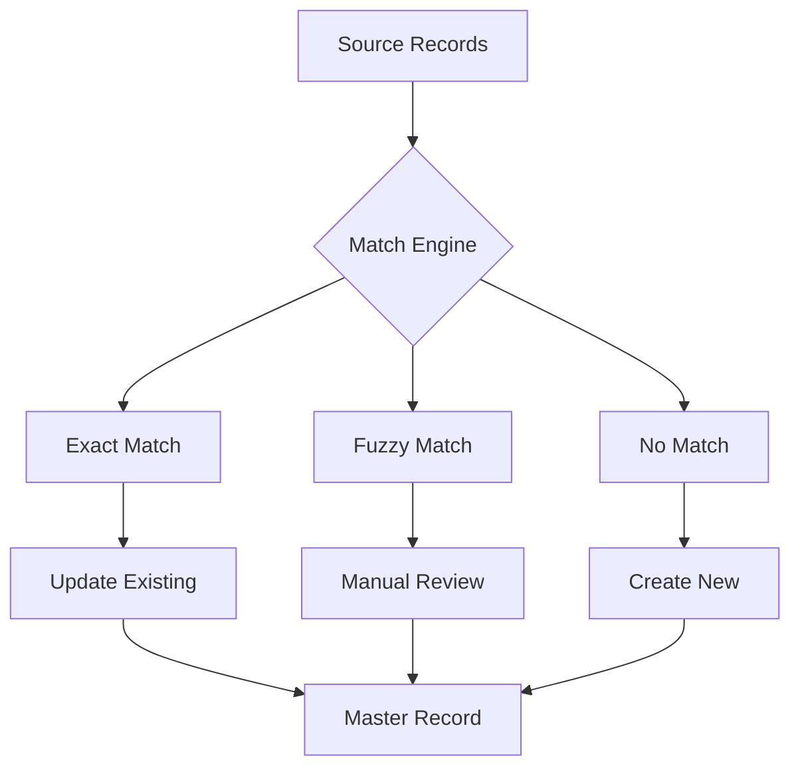
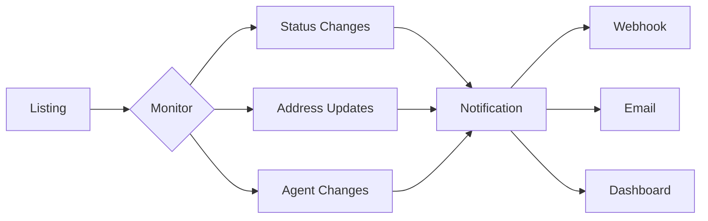

import { Card, CardGroup } from '@/components/card'
import { Tab, Tabs } from '@/components/tabs'
import { CodeGroup } from '@/components/code-group'
import { ResponseField, Expandable } from '@/components/response-field'

# Business Listings

The Public Listings API provides access to a comprehensive database of business entities aggregated from authoritative government sources. This system decouples public data aggregation from private business workflows, creating a robust and secure system for managing business information.

## Available Operations

<CardGroup cols={2}>
  <Card title="Search Listings" icon="magnifying-glass" href="/api-reference/listings/search">
    Search and filter business records across multiple jurisdictions
  </Card>
  <Card title="Get Listing" icon="eye" href="/api-reference/listings/retrieve">
    Retrieve detailed information for a specific business listing
  </Card>
  <Card title="Claim Listing" icon="flag" href="/api-reference/listings/claim">
    Initiate the process of claiming ownership of a business listing
  </Card>
  <Card title="Get Claim Status" icon="check" href="/api-reference/listings/claim-status">
    Check the current status of a claim request
  </Card>
</CardGroup>

## System Architecture

The listings system is designed for high-scale data processing and real-time search capabilities. Here are different views of the architecture:

<Tabs>
  <Tab title="Data Flow">
    ```mermaid
    graph TB
      A[Data Sources] --> B[Ingestion Service]
      B --> C[Validation Queue]
      C --> D[Processing Service]
      D --> E[Business Rules Engine]
      E --> F[Entity Resolution]
      F --> G[Primary Database]
      G --> H[Search Index]
      G --> I[Public API]
      G --> J[Private API]
      K[Claim Service] --> L[Verification Engine]
      L --> M[Profile Database]
      I --> N[Public Access]
      J --> O[Business Portal]
      style A fill:#f9f,stroke:#333
      style G fill:#9cf,stroke:#333
      style M fill:#9cf,stroke:#333
      style H fill:#fcf,stroke:#333
    ```
  </Tab>
  <Tab title="Component View">
    ```mermaid
    graph LR
      subgraph Storage
        DB[(Primary DB)]
        Search[[Search Index]]
        Cache((Redis Cache))
      end
      subgraph Services
        API[API Gateway]
        Auth[Auth Service]
        Search_Svc[Search Service]
        Profile[Profile Service]
      end
      subgraph Processing
        ETL[ETL Pipeline]
        Match[Entity Matching]
        Enrich[Data Enrichment]
      end
      API --> Auth
      API --> Search_Svc
      API --> Profile
      Search_Svc --> Search
      Search_Svc --> Cache
      Profile --> DB
      ETL --> Match
      Match --> Enrich
      Enrich --> DB
    ```
  </Tab>
  <Tab title="User Flow">
    ```mermaid
    sequenceDiagram
      participant U as User
      participant API as Public API
      participant S as Search Service
      participant V as Verification
      participant DB as Database
      U->>API: Search Request
      API->>S: Process Search
      S->>DB: Query Data
      DB-->>S: Return Results
      S-->>API: Format Response
      API-->>U: Display Results
      U->>API: Claim Request
      API->>V: Initiate Verification
      V->>DB: Create Claim Record
      DB-->>V: Confirm Creation
      V-->>API: Return Claim Status
      API-->>U: Show Confirmation
    ```
  </Tab>
</Tabs>

## Key Features

### Data Aggregation
- Real-time data collection from state registries
- Automated validation and standardization
- Multi-source entity resolution
- Continuous data refresh cycles

### Search Capabilities
- Full-text search across all fields
- Geospatial queries for location-based search
- Fuzzy matching for business names
- Advanced filtering options
- Real-time results with caching

### Business Verification
- Multi-step verification process
- Document-based validation
- Agent verification system
- EIN matching capabilities
- Manual review options

## Quick Start

<CodeGroup>

```typescript
// TypeScript SDK
import { PalmAPI } from '@palm/sdk';

const palm = new PalmAPI({
  apiKey: 'YOUR_API_KEY',
  environment: 'production'
});

// Search for businesses
const searchResults = await palm.listings.search({
  query: 'acme',
  jurisdiction: 'CA',
  entityType: 'corporation',
  status: 'active'
});

// Get specific listing
const listing = await palm.listings.retrieve('list_123abc');

// Claim a listing
const claim = await palm.listings.claim('list_123abc', {
  verificationMethod: 'DOCUMENT',
  documents: [{
    type: 'FORMATION',
    file: documentFile
  }],
  contact: {
    name: 'John Doe',
    email: 'john@acme.com',
    phone: '+1234567890'
  }
});
```

```python
# Python SDK
from palm import Client

palm = Client(api_key='YOUR_API_KEY')

# Search for businesses
results = palm.listings.search(
    query='acme',
    jurisdiction='CA',
    entity_type='corporation',
    status='active'
)

# Get specific listing
listing = palm.listings.retrieve('list_123abc')

# Claim a listing
claim = palm.listings.claim(
    'list_123abc',
    verification_method='DOCUMENT',
    documents=[{
        'type': 'FORMATION',
        'file': document_file
    }],
    contact={
        'name': 'John Doe',
        'email': 'john@acme.com',
        'phone': '+1234567890'
    }
)
```

```ruby
# Ruby SDK
require 'palm'

palm = Palm::Client.new(api_key: 'YOUR_API_KEY')

# Search for businesses
results = palm.listings.search(
  query: 'acme',
  jurisdiction: 'CA',
  entity_type: 'corporation',
  status: 'active'
)

# Get specific listing
listing = palm.listings.retrieve('list_123abc')

# Claim a listing
claim = palm.listings.claim(
  'list_123abc',
  verification_method: 'DOCUMENT',
  documents: [{
    type: 'FORMATION',
    file: document_file
  }],
  contact: {
    name: 'John Doe',
    email: 'john@acme.com',
    phone: '+1234567890'
  }
)
```

</CodeGroup>

## Data Models

### Business Listing Object

<CodeGroup>

```typescript
// Full Object
interface BusinessListing {
  // Core Information
  id: string;                    
  business_name: string;         
  dba_names: string[];          
  entity_type: EntityType;       
  formation_state: string;      
  formation_date: string;       
  status: EntityStatus;         
  
  // Address Information
  registered_address: Address;  
  mailing_address?: Address;    
  
  // Registration Details
  entity_number: string;       
  jurisdiction: string;        
  registered_agent?: RegisteredAgent;
  
  // Source Information
  data_sources: DataSourceMetadata[];
  last_updated: string;
  last_verified: string;
  
  // Classification
  industry_categories?: string[];
  naics_codes?: string[];
  sic_codes?: string[];
  
  // Location Data
  location_coordinates?: GeoCoordinates;
  
  // Online Presence
  website?: string;
  social_profiles?: SocialProfile[];
  
  // Quality Metrics
  confidence_score: number;
  data_completeness: number;
  
  // Claim Status
  is_claimed: boolean;
  claim_status?: ClaimStatus;
  has_profile?: boolean;
  
  // Compliance
  good_standing: boolean;
  filing_status: FilingStatus;
  renewal_date?: string;
}
```

```typescript
// Supporting Types
interface Address {
  street1: string;
  street2?: string;
  city: string;
  state: string;
  postal_code: string;
  country: string;
  type: AddressType;
  validated: boolean;
}

interface RegisteredAgent {
  name: string;
  type: 'INDIVIDUAL' | 'BUSINESS';
  address: Address;
  appointment_date?: string;
}

interface DataSourceMetadata {
  source_name: string;
  source_type: 'GOVERNMENT' | 'COMMERCIAL' | 'USER_SUBMITTED';
  last_updated: string;
  confidence: number;
  raw_data?: any;
}

interface GeoCoordinates {
  latitude: number;
  longitude: number;
  accuracy?: number;
}

interface SocialProfile {
  platform: string;
  url: string;
  verified: boolean;
}
```

</CodeGroup>

## API Operations

### Search Parameters

<ResponseField name="query" type="string">
  Text search query matching business names, DBAs, and registration numbers
  
  <Expandable title="Query Syntax">
    - Exact phrase: `"acme corporation"`
    - OR operation: `acme OR apex`
    - Exclude terms: `-dissolved`
    - Field specific: `name:acme`
  </Expandable>
</ResponseField>

<ResponseField name="filters" type="object">
  Filter criteria for narrowing results
  
  <Expandable title="Available Filters">
    - `jurisdiction`: State/territory code
    - `entity_type`: Business structure
    - `status`: Registration status
    - `formation_date`: Date range
    - `industry`: Industry categories
    - `standing`: Good standing status
  </Expandable>
</ResponseField>

<ResponseField name="sort" type="object">
  Result ordering preferences
  
  <Expandable title="Sort Options">
    - `relevance`: Match score (default)
    - `name`: Business name
    - `formation_date`: Registration date
    - `confidence`: Data confidence score
  </Expandable>
</ResponseField>

### Verification Methods

<CardGroup cols={2}>
  <Card title="Document Upload" icon="file-upload">
    Submit formation documents, licenses, or tax records
    
    - Articles of Incorporation
    - Operating Agreements
    - EIN Letters
    - Business Licenses
  </Card>
  
  <Card title="Agent Verification" icon="user-check">
    Verify through registered agent information
    
    - Agent Name Match
    - Address Verification
    - Appointment Validation
  </Card>
  
  <Card title="Identity Verification" icon="id-card">
    Verify business owner identity
    
    - Government ID
    - Live Photo Match
    - Background Check
  </Card>
  
  <Card title="Manual Review" icon="magnifying-glass">
    Human verification process
    
    - Document Review
    - Phone Verification
    - Physical Location Check
  </Card>
</CardGroup>

## Advanced Features

### Entity Resolution

The system uses advanced entity resolution to:
- Match businesses across multiple data sources
- Prevent duplicate listings
- Combine partial information into complete profiles
- Track business changes over time



### Data Quality Scoring

<CardGroup cols={2}>
  <Card title="Confidence Score" icon="chart-line">
    Calculated based on:
    - Source reliability
    - Data freshness
    - Cross-validation
    - Verification status
  </Card>
  
  <Card title="Completeness Score" icon="chart-pie">
    Measures presence of:
    - Required fields
    - Optional details
    - Supporting documents
    - Verified information
  </Card>
</CardGroup>

## Error Handling

### Common Error Codes

| Code               | Description                       | Resolution                     |
|--------------------|-----------------------------------|--------------------------------|
| `INVALID_REQUEST`  | Missing or invalid parameters     | Check request parameters       |
| `NOT_FOUND`        | Resource doesn't exist            | Verify identifier              |
| `RATE_LIMITED`     | Too many requests                 | Implement backoff              |
| `UNAUTHORIZED`     | Invalid credentials               | Check API key                  |
| `FORBIDDEN`        | Insufficient permissions          | Verify access level            |
| `CONFLICT`         | Resource conflict                 | Check existing claims          |

### Error Response Format

```json
{
  "error": {
    "code": "ERROR_CODE",
    "message": "Human readable message",
    "details": {
      "field": "Specific field causing error",
      "reason": "Detailed explanation",
      "suggestion": "How to fix"
    },
    "request_id": "UUID for support reference",
    "documentation_url": "Link to relevant docs"
  }
}
```

## Best Practices

### Search Optimization
1. Use specific search terms
2. Leverage filters for precision
3. Handle pagination properly
4. Cache frequent searches
5. Implement rate limiting

### Data Management
1. Regular data refresh
2. Monitor confidence scores
3. Track data changes
4. Implement webhooks
5. Archive historical data

### Security
1. Rotate API keys regularly
2. Implement request signing
3. Use TLS for all requests
4. Monitor usage patterns
5. Log access attempts

## Rate Limits

### Default Limits

| Tier | Endpoint  | Rate | Window | Burst |
|------|-----------|------|--------|-------|
| Free | Search    | 100  | minute | 150   |
| Free | Retrieve  | 200  | minute | 300   |
| Free | Claim     | 10   | minute | 15    |
| Pro  | Search    | 1000 | minute | 1500  |
| Pro  | Retrieve  | 2000 | minute | 3000  |
| Pro  | Claim     | 100  | minute | 150   |

### Rate Limit Headers

```http
X-RateLimit-Limit: 100
X-RateLimit-Remaining: 95
X-RateLimit-Reset: 1706633400
```

## Webhooks

### Available Events

<CardGroup cols={2}>
  <Card title="Listing Updates" icon="refresh">
    - `listing.updated`
    - `listing.verified`
    - `listing.claimed`
  </Card>
  
  <Card title="Claim Events" icon="flag">
    - `claim.created`
    - `claim.verified`
    - `claim.rejected`
  </Card>
  
  <Card title="Verification" icon="shield-check">
    - `verification.started`
    - `verification.completed`
    - `verification.failed`
  </Card>
  
  <Card title="Documents" icon="file">
    - `document.uploaded`
    - `document.verified`
    - `document.rejected`
  </Card>
</CardGroup>

## Related Resources

<CardGroup cols={2}>
  <Card title="Business Verification Guide" icon="shield-check" href="/guides/business-verification">
    Comprehensive guide to verification requirements and processes
    - Document requirements
    - Verification workflows
    - Best practices
  </Card>
  
  <Card title="Document Management" icon="file" href="/api-reference/documents/overview">
    Handle verification documents efficiently
    - Upload guidelines
    - Supported formats
    - Storage policies
  </Card>
  
  <Card title="Webhook Integration" icon="bell" href="/guides/webhook-integration">
    Real-time notifications for listing changes
    - Event types
    - Payload formats
    - Security measures
  </Card>
  
  <Card title="API Security" icon="lock" href="/guides/api-security">
    Security best practices and guidelines
    - Authentication
    - Authorization
    - Data protection
  </Card>
</CardGroup>

## Data Enrichment

### Available Enrichments

<Tabs>
  <Tab title="Business Information">
    ```mermaid
    graph TD
      A[Raw Listing] --> B[Name Standardization]
      A --> C[Address Validation]
      A --> D[Phone Verification]
      B --> E[DBA Matching]
      C --> F[Geocoding]
      D --> G[Carrier Lookup]
      E --> H[Enriched Listing]
      F --> H
      G --> H
    ```
  </Tab>
  <Tab title="Industry Classification">
    ```mermaid
    graph TD
      A[Business Name] --> B[Text Analysis]
      A --> C[Website Scraping]
      B --> D[Industry Matching]
      C --> D
      D --> E[NAICS Codes]
      D --> F[SIC Codes]
      E --> G[Enriched Profile]
      F --> G
    ```
  </Tab>
  <Tab title="Online Presence">
    ```mermaid
    graph TD
      A[Domain Name] --> B[Website Discovery]
      A --> C[Social Media Search]
      B --> D[Content Analysis]
      C --> E[Profile Verification]
      D --> F[Enriched Data]
      E --> F
    ```
  </Tab>
</Tabs>

## Advanced Search Features

### Geospatial Search

```typescript
// Search businesses within radius
const nearbyBusinesses = await palm.listings.search({
  location: {
    latitude: 37.7749,
    longitude: -122.4194,
    radius: 5, // miles
  },
  type: 'restaurant'
});

// Search by boundary
const businessesInArea = await palm.listings.search({
  boundary: {
    type: 'polygon',
    coordinates: [
      [lon1, lat1],
      [lon2, lat2],
      [lon3, lat3]
    ]
  }
});
```

### Fuzzy Matching

<CodeGroup>
```typescript
// Fuzzy Name Match
const results = await palm.listings.search({
  query: 'acme corp',
  fuzzy: {
    enabled: true,
    threshold: 0.8,
    maxExpansions: 50
  }
});
```

```typescript
// Phonetic Match
const results = await palm.listings.search({
  query: 'teknology',
  matching: {
    type: 'phonetic',
    algorithm: 'double_metaphone'
  }
});
```
</CodeGroup>

## Compliance & Monitoring

### Automated Monitoring



### Compliance Checks

<CardGroup cols={2}>
  <Card title="Registration Status" icon="file-certificate">
    - Active status
    - Good standing
    - Filing compliance
    - Annual reports
  </Card>
  
  <Card title="Agent Status" icon="user">
    - Current appointment
    - Address validity
    - Service status
    - Change history
  </Card>
  
  <Card title="Document Status" icon="file">
    - Required filings
    - Expiration dates
    - Renewal deadlines
    - Missing documents
  </Card>
  
  <Card title="Address Status" icon="map-pin">
    - Address validation
    - Mail deliverability
    - Change verification
    - Jurisdiction compliance
  </Card>
</CardGroup>

## SDK Support

### Available SDKs

<CardGroup cols={3}>
  <Card title="Node.js" icon="node-js">
    ```bash
    npm install @palm/sdk
    ```
  </Card>
  
  <Card title="Python" icon="python">
    ```bash
    pip install palm-api
    ```
  </Card>
  
  <Card title="Ruby" icon="gem">
    ```bash
    gem install palm-api
    ```
  </Card>
</CardGroup>

### SDK Features

- Type definitions included
- Automatic retry handling
- Rate limit management
- Webhook verification
- Response parsing
- Error handling
- Logging options
- Metrics tracking

## Testing & Development

### Sandbox Environment

```typescript
const palm = new PalmAPI({
  apiKey: 'YOUR_TEST_API_KEY',
  environment: 'sandbox'
});
```

### Test Data Generation

<CodeGroup>
```bash
# Generate Test Data
curl -X POST "https://api.sandbox.palm.com/v1/test/generate" \
  -H "Authorization: Bearer YOUR_TEST_API_KEY" \
  -d '{
    "type": "business_listing",
    "count": 10,
    "jurisdiction": "CA",
    "industry": "technology"
  }'
```

```typescript
// TypeScript
const testData = await palm.test.generate({
  type: 'business_listing',
  count: 10,
  jurisdiction: 'CA',
  industry: 'technology'
});
```
</CodeGroup>

## Support & Troubleshooting

<CardGroup cols={2}>
  <Card title="Documentation" icon="book">
    - API Reference
    - Integration guides
    - Best practices
    - Examples
  </Card>
  
  <Card title="Support Channels" icon="headset">
    - Email support
    - Community forum
    - Office hours
    - Priority support
  </Card>
  
  <Card title="Tools" icon="wrench">
    - Status page
    - API playground
    - Debugging tools
    - Test suite
  </Card>
  
  <Card title="Resources" icon="folder">
    - Sample code
    - Use cases
    - Case studies
    - Tutorials
  </Card>
</CardGroup>
```
